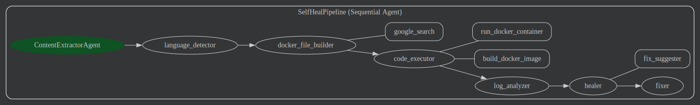

# Self-Heal Agent

An intelligent automated test healing system that analyzes failing test scripts, identifies root causes, and automatically generates fixes using AI-powered agents.

## Overview

The Self-Heal Agent is a proof-of-concept system that takes a website URL and a test script as input, executes the test in an isolated Docker environment, analyzes any failures, and automatically generates and applies fixes. The system uses Google's Agent Development Kit (ADK) with a sequential pipeline of specialized AI agents, each handling a specific aspect of the test healing process.

### Key Features

- **Automated Test Execution**: Runs test scripts in isolated Docker containers
- **Intelligent Failure Analysis**: Identifies root causes, categorizes errors, and assesses severity
- **Automatic Fix Generation**: Generates patches with unified diff format and safety checks
- **Multi-Framework Support**: Works with pytest, unittest, Cypress, Playwright, Jest, Behave, Selenium, and more
- **Browser Test Support**: Handles headless browser execution with Xvfb for graphical browser requirements
- **Smart Dockerfile Generation**: Uses web search to find current dependencies and best practices
- **Retry Logic**: Automatic retry on Docker build failures (up to 3 attempts)
- **Safety Checks**: AST compilation and regex validation for generated code fixes

## Architecture

The system uses a **SequentialAgent pipeline** (`SelfHealPipeline`) that processes requests through 7 specialized sub-agents:

### Agent Pipeline



The pipeline executes in the following sequence:

1. **ContentExtractorAgent** (`context_extractor.py`)

   - **Purpose**: Extracts the website URL and test script from free-form user input and structures it into JSON format
   - **Type**: LlmAgent (LLM-based agent)
   - **Tools**: None (uses LLM only)
   - **Output**: Structured JSON `{ "website": "...", "testScript": "..." }` stored in `user_input_json`

2. **Language Detector** (`language_detector.py`)

   - **Purpose**: Identifies the programming language, test framework, and determines the appropriate command to run the test
   - **Type**: Agent (LLM-based agent)
   - **Tools**: None (uses LLM only)
   - **Output**: Detection results with language, framework, runner_cmd, confidence, and reasoning stored in `language_detection_results`

3. **Docker File Builder** (`docker_file_builder.py`)

   - **Purpose**: Generates a complete, ready-to-build Dockerfile for test execution with all necessary dependencies
   - **Type**: Agent (LLM-based agent)
   - **Tools**:
     - `google_search` - Searches for current dependencies and stable versions
   - **Output**: Complete Dockerfile content stored in `docker_file_content`
   - **Special Features**: Handles browser-based tests with Xvfb, creates custom entrypoint scripts for graphical browser requirements

4. **Code Executor** (`code_executor.py`)

   - **Purpose**: Builds Docker images and executes test scripts in isolated containers
   - **Type**: Agent (LLM-based agent)
   - **Tools**:
     - `build_docker_image` (Function Tool) - Builds Docker image from Dockerfile with retry logic (up to 3 attempts)
     - `run_docker_container` (Function Tool) - Executes the test script in the container and captures logs
   - **Output**: Test execution results and logs stored in `test_run_results`

5. **Log Analyzer** (`log_analyzer.py`)

   - **Purpose**: Analyzes test execution logs to identify failures, root causes, and categorize fix types
   - **Type**: Agent (LLM-based agent)
   - **Tools**: None (uses LLM only)
   - **Output**: Structured analysis report with root causes, fix categories, severity, and error types stored in `log_analysis_report`

6. **Healer** (`healer.py`)

   - **Purpose**: Generates fix patches based on log analysis with safety validation
   - **Type**: Agent (LLM-based agent)
   - **Tools**:
     - `fix_suggester` (Agent Tool) - Wraps the fix_suggester agent to provide framework-specific fix suggestions
   - **Output**: Unified diff format with patched files, rationale, assumptions, confidence scores, and safety checks stored in `healer_results`
   - **Safety Features**: Validates code safety (no eval, exec, os.system, or unsafe subprocess calls)

7. **Fixer** (`fixer.py`)
   - **Purpose**: Applies patches from the healer to the original test script
   - **Type**: Agent (LLM-based agent)
   - **Tools**: None (uses LLM only)
   - **Output**: Complete fixed code in the original language/framework format

## Installation & Setup

### Prerequisites

- Python 3.12 or higher
- Docker installed and running
- Google ADK access (for agent framework)

### Installation

1. Clone the repository:

```bash
git clone <repository-url>
cd self-heal-agent
```

2. Install dependencies:

```bash
pip install -r requirements.txt
```

Or if using `uv` (recommended):

```bash
uv sync
```

### Environment Configuration

Create a `.env` file in the project root with the following environment variables:

- `LLM_MODEL_NAME`: LLM model to use (default: `gemini-2.5-flash`)
  - Example: `LLM_MODEL_NAME=gemini-2.5-flash`
- Other environments as required by your LLM provider.

The sandbox path defaults to `./sandbox_folder` (configurable in `config.py`).

## Usage

To run the Self-Heal Agent:
From project directory

```bash
adk web
```

This will start the ADK web interface where you can interact with the agent pipeline.

### Input Format

Provide your input in free-form text containing:

- A website URL to test
- A test script (in any supported language/framework)

Example:

````
Website: https://example.com
Test Script:
```python
import pytest
from selenium import webdriver

def test_login():
    driver = webdriver.Chrome()
    driver.get("https://example.com")
    driver.find_element(By.ID, "login-button").click()
    assert "Welcome" in driver.page_source
````

````

### Expected Output

The pipeline will:
1. Extract and parse your input
2. Detect the language and framework
3. Generate and build a Docker environment
4. Execute the test
5. Analyze any failures
6. Generate and apply fixes
7. Return the fixed test script

## Configuration

### LLM Configuration

The system uses Google's Gemini models by default. Configure the model in `self_heal_agent/config.py` or via environment variable:

```python
# config.py
@dataclass
class LLMConfig:
    model_name: str = os.getenv("LLM_MODEL_NAME", default="gemini-2.5-flash")
    sandbox_path: str = str(Path("./sandbox_folder").resolve())
````

### Sandbox Directory

The sandbox directory is where Docker files and test scripts are temporarily stored. Default location: `./sandbox_folder`

To change it, modify `config.sandbox_path` in `config.py`.

## Project Structure

```
self-heal-agent/
├── assets/
│   └── agent-diagram.svg          # Visual representation of agent pipeline
├── self_heal_agent/
│   ├── __init__.py
│   ├── agent.py                    # Main SequentialAgent pipeline definition
│   ├── config.py                   # Configuration settings
│   ├── tools.py                    # Docker operations (build, run containers)
│   └── sub_agents/
│       ├── __init__.py
│       ├── context_extractor.py    # ContentExtractorAgent
│       ├── language_detector.py    # Language/framework detection
│       ├── docker_file_builder.py  # Dockerfile generation
│       ├── code_executor.py        # Docker build and execution
│       ├── log_analyzer.py         # Failure analysis
│       ├── healer.py               # Fix generation
│       ├── fixer.py                # Fix application
│       └── fix_suggester.py        # Framework-specific fix suggestions
├── main.py                         # Entry point (placeholder)
├── pyproject.toml                  # Project dependencies
├── uv.lock                        # Dependency lock file
└── README.md                       # This file
```

## Technical Details

### Supported Test Frameworks

- **Python**: pytest, unittest, behave
- **JavaScript**: Jest, Cypress, Playwright, Puppeteer
- **Web Automation**: Selenium (all languages)
- **BDD**: Behave, Cucumber

### Docker Integration

- Uses Docker Python SDK for container management
- Generates Dockerfiles dynamically based on test requirements
- Supports headless browser execution with Xvfb
- Automatic cleanup of build artifacts

### Error Handling

- **Docker Build Failures**: Up to 3 retry attempts with log analysis
- **Container Execution**: Single attempt with detailed error reporting
- **Code Safety**: AST compilation checks and regex validation for generated fixes
- **Framework Detection**: Confidence scoring with fallback handling

### Safety Features

The healer agent includes multiple safety checks:

- AST compilation validation
- Regex pattern checks for dangerous code
- Explicit blocking of `eval()`, `exec()`, `os.system()`, and unsafe subprocess calls
- Confidence scoring for generated fixes

## Dependencies

- `docker>=7.1.0`: Docker Python SDK for container operations
- `google-adk>=1.19.0`: Google Agent Development Kit for agent framework

## License

Licensed under the Apache License, Version 2.0. See [LICENSE](LICENSE) file for details.
